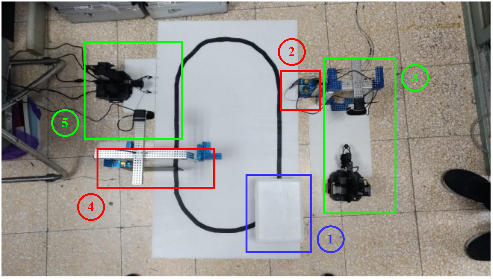
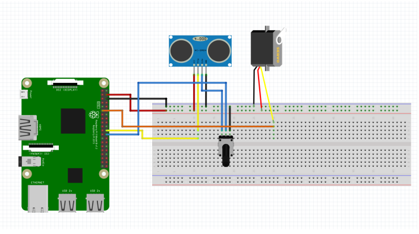
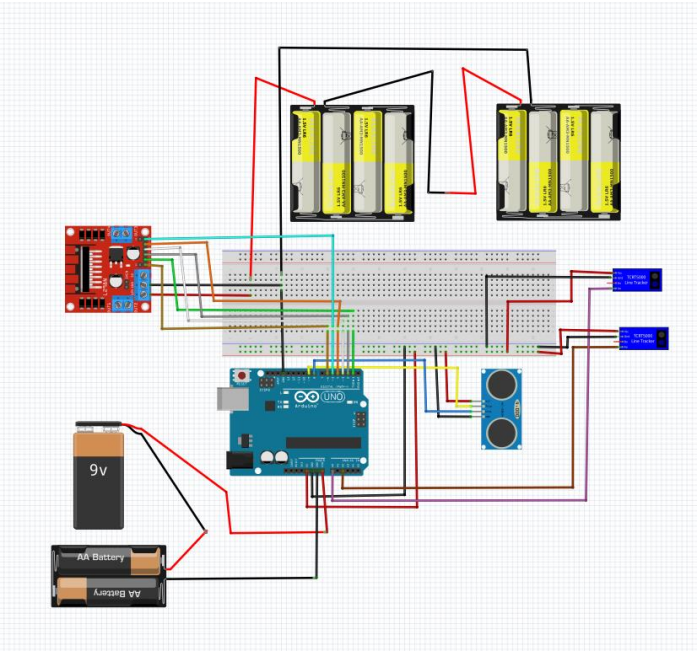

# Automated Transport Line (Using uArm)
Welcome to my senior project. This marks my first attempt at using image processing for task execution. While relatively simple, it should be sufficient for the task environment. :)
## Introduction
In this project, we utilized the uArm Swift Pro robotic arm to accomplish the gripping of various-shaped building blocks. Subsequently, we employed an Arduino Uno-controlled autonomous transport vehicle to transport the building blocks to another robotic arm for unloading. Throughout this process, a Raspberry Pi was employed for image recognition and control of the robotic arm's gripping actions. Additionally, we controlled a gate to ensure the transport vehicle could stop at the unloading point.  [video link](https://www.youtube.com/watch?v=BXoDqY-PUAk)
## Requirements
### Software
* opencv-python 3.4.6
* RPi.GPIO
* random
* uarm.wrapper
* time
* [uArm-Python-SDK](https://github.com/uArm-Developer/uArm-Python-SDK/tree/2.0)
### Hardware
* uArm Swift Pro * 2
* Raspberry Pi 3 Model B+ * 2
* Arduino Uno
* Logitech C270 Webcam * 2
* L298N
* HC-SR04 * 3
* DC3V-6V Reduction Motor * 2
* TCR5000 * 2
* SG90 Servo Motor (used for gate control) * 2

The rest of the miscellaneous details can be found in the attached document.
## Descriptions

The workflow of this project is as follows:

1. AGV starts and moves forward after confirming no obstacles ahead.
2. Loading area gate detects AGV and lowers the gate to stop the AGV.
3. Image recognition identifies items in the loading area. The robotic arm loads goods onto the AGV and raises the gate for AGV to proceed.
4. Unloading area gate detects AGV and lowers the gate to stop the AGV.
5. Image recognition identifies items on the AGV platform. The robotic arm picks up the goods and unloads them in the unloading area, raising the gate for AGV to move forward.

Within this process, two Raspberry Pis are primarily responsible for detecting the proximity of the AGV, controlling the raising and lowering of gates, and managing the robotic arms in the loading and unloading areas. The wiring diagram is provided below, where both the robotic arms and cameras are connected to the USB ports of the Raspberry Pis. For detailed circuit explanations, please refer to the senior project documentation(P.37).

The final component is the AGV, where we utilize the Arduino Uno to assemble our Automated Guided Vehicle (AGV). Below is its wiring diagram:

## Usage
You can decide the layout settings for the loading and unloading areas on your own. Through `Loading_cargo.py` and `Unloading_cargo.py`, you can refer to the comments inside and modify the coordinates of the robotic arm. We calculate the difference between the coordinates of the robotic arm and the camera by subtraction. You can refer to the senior project documentation(P.33) for details on how to calculate the coordinates. Additionally, when using these two scripts, please place them within the uArm-Python-SDK environment.
## License

The MIT License ([MIT](https://mit-license.org/))   
Copyright © 2024 <https://github.com/yahfou>
